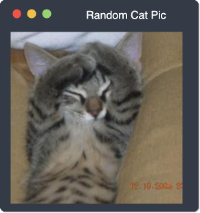

# OS-Window Reactjs Component


> A React.js wrapper around [os-window][os-window] which provides support for React.js events and properties.

## Getting started

Choose any of the following methods to get started. You also need to install the actual [os-window][os-window] library. For development you also need to install `prop-types`.

### Install via node package manager

Run the following command in your command line to add both os-window and os-window-reactjs to your project. You also need to add prop-types to your devDependencies.
```shell
# for NPM
> npm install --save os-window os-window-reactjs && npm install --save-dev prop-types

# for YARN
> yarn add os-window os-window-reactjs prop-types && yarn add -D prop-types
```

#### Including the base library

In your application entrypoint you need to include the library `os-window`. Afterwards you can use the reactjs component as shown in the example section:

```javascript
import 'os-window';
import 'os-window-reactjs';
```

### Inclusion in the Browser

You can also directly include the JavaScript module in the browser with the `browser.js` entrypoint:

```html
<!DOCTYPE html>
<html>
  <head>
    <meta charset="utf-8">
    <script type="module" src="node_modules/prop-types/prop-types.js"></script>
    <script type="module" src="node_modules/react/umd/react.development.js"></script>
    <script type="module" src="node_modules/react-dom/umd/react-dom.development.js"></script>
    <script type="module" src="node_modules/os-window/main.js"></script>
    <script type="module" src="node_modules/os-window-reactjs/browser.js"></script>
  </head>
  <body>
    <div id="app"></div>
    <script type="module">
      ReactDOM.render(
        React.createElement(
          window.OsWindowReact,
          { },
          React.createElement(
            'img',
            {
              src: 'https://placekitten.com/250/250',
            },
            null
          ),
        ),
        document.querySelector('#app')
      );
    </script>
  </body>
</html>
```

### Use the CDN
This project is also published to the CDN unpkg, which enables you to skip any local module installation when including this module in your webpage. Don't forget to also include `os-window` and 'prop-types', which are also provided by unpkg:

```html
<!-- Include specific version (recommended) -->
<script type="module" src="https://unpkg.com/os-window@0.3.0"></script>
<script type="module" src="https://unpkg.com/os-window-reactjs@0.1.0/browser.js"></script>

<!-- Include latest version (not recommended) -->
<script type="module" src="https://unpkg.com/os-window"></script>
<script type="module" src="https://unpkg.com/os-window-reactjs/browser.js"></script>
```

For more information have a look at the [Installation Guide](./doc/installation.md) or the detailled [documentation](./doc/index.md).

## Demo
Try the latest version of os-window-reactjs online at <a href="https://bit.ly/3eYBYkU" target="_blank">https://bit.ly/3eYBYkU</a>!

## Examples

This example creates a non-interactive window with light macos theme
```jsx
import 'os-window';
import OsWindowReactjs from 'os-window-reactjs';

function App() {
  return (
    <OsWindowReactjs
      windowTitle="Random Cat Pic"
    >
      
    </OsWindowReactjs>
  );
}

export default App;
```




The next example creates a fully interactive window with dark macos theme
```jsx
import 'os-window';
import OsWindowReactjs from 'os-window-reactjs';

function App() {
  return (
    <OsWindowReactjs
      hover
      interactive
      osTheme="mac"
      theme="dark"
      windowState="maximized"
      windowTitle="Random Cat Pic"
    >
      
    </OsWindowReactjs>
  );
}

export default App;
```
## Requirements

  - os-window: Ver. >= 0.3.0
  - Reactjs: Ver. >= 17.0.0
  - Browsers:
    - IE: not supported
    - Edge: Ver. >= 80
    - Firefox: Ver. >= 63
    - Chrome: Ver. >= 67
    - Safari: Ver. >= 10.1
    - Opera: Ver >= 41

For development additionally:
  - prop-types: Ver. >= 15.7

## Documentation

Find more detailed information in the [documentation](./doc/index.md).

## Contributing
If you have any ideas, just [open an issue][issues] and tell me what you think.

If you find any bugs, just [open an issue][issues] and let me know. Or go right ahead and create a [pull request][pulls].

If you'd like to contribute, please fork the repository and make changes as
you'd like. Pull requests are warmly welcome.

## Licensing

This project is licensed under MIT license. You'll find a copy of the MIT license in the file [LICENSE](LICENSE).

[issues]:https://github.com/benjaminsattler/os-window-reactjs/issues/new
[pulls]:https://github.com/benjaminsattler/os-window-reactjs/pulls
[os-window]:https://github.com/benjaminsattler/os-window
